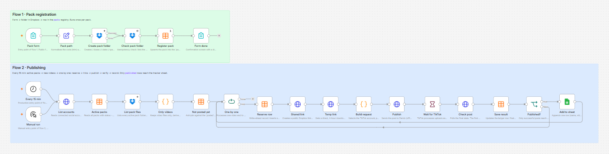
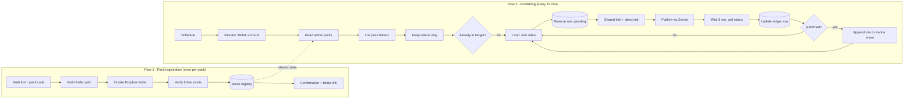

# Dropbox → TikTok publisher (n8n)

An n8n workflow that publishes video creatives from Dropbox to TikTok and records every result in Google Sheets. A content team registers a pack in a web form, drops the finished videos into the folder the workflow created, and the rest runs unattended.



| | |
|---|---|
| **Status** | Working end to end; in pilot use |
| **Stack** | n8n 2.41 (self-hosted, Docker) · Dropbox API · Zernio API (TikTok Content Posting API) · Google Sheets API · n8n Data Tables |
| **Size** | 24 nodes, 2 flows, 2 Code nodes |
| **Build** | Designed, built and tested in 4 days with an AI coding assistant |

No browser automation, cookies or scraping: publishing goes through TikTok's official Content Posting API via an approved provider.

## The problem

A marketing team produces TikTok creatives in packs. For each pack someone had to upload every video to TikTok by hand, copy the resulting video ID and paste it, together with the file name and a Dropbox link, into the tracking sheet used for ad reporting. The work is repetitive, and a wrong ID in the sheet silently breaks the reporting built on top of it.

Requirements:

1. Publish only the packs the team explicitly marks as ready, not everything in the day's folder.
2. Never publish the same video twice.
3. Keep the mapping *file name ↔ TikTok video ID ↔ Dropbox link* exact.
4. Append to the existing tracker without touching its data or formulas.
5. No daily involvement beyond entering a pack code.

## How it works



The two flows never call each other. They communicate only through the `packs` table, so the form stays responsive and publishing can fail or be paused without affecting registration.

## Sub-problems and how each was solved

| # | Sub-problem | Method |
|---|---|---|
| 1 | **Selecting the right folder.** A day's folder holds many packs; only some belong to this team. Nothing in Dropbox distinguishes them. | Explicit registration: a form takes the pack code, the workflow creates the folder itself and stores it in a registry table. Publishing reads the registry, never the whole tree. |
| 2 | **Idempotent folder creation.** Re-submitting a code hits "folder already exists", and n8n replaces Dropbox's error text with a generic message, so the cause cannot be detected from the error. | Verify the outcome instead of parsing the error: the create node routes failures to an error output, and both outputs feed a list-folder check. If the folder lists, it exists; a real failure stops the run there. |
| 3 | **No trigger available.** n8n has no Dropbox trigger, and the instance had no public address for inbound webhooks. | Scheduled polling every 15 minutes, both for new files and for the final post status. |
| 4 | **Exactly-once publishing.** Overlapping runs, a crash after publishing or a lost response would post a video twice; TikTok posts cannot be deleted through the API. | A ledger table keyed by the lower-cased Dropbox path. An anti-join drops known files; a `pending` row is written **before** the publish call (write-ahead); the insert is an upsert; automatic retries are disabled on the publish request. |
| 5 | **Failure isolation in a batch.** n8n passes all items through each node together, so one failure mid-batch would leave earlier videos published but unrecorded. | A loop with batch size 1: each video completes publish → verify → record before the next starts. Both branches of the final condition return to the loop. |
| 6 | **The publishing API needs a raw file URL.** Dropbox shared links return an HTML preview page, which the API rejects. | Two links per file: a 4-hour direct link (`files/get_temporary_link`) for the API, and a permanent shared link for humans in the tracker. |
| 7 | **OAuth scope limitation.** n8n's built-in Dropbox credential requests a fixed scope set without `sharing.write`; enabling the scope on the Dropbox app has no effect. | A second, generic OAuth2 credential for the same Dropbox app with an explicit scope list and `token_access_type=offline` for refresh tokens. |
| 8 | **"Shared link already exists".** Dropbox answers HTTP 409 on a repeat request and puts the existing link inside the error body. | The request returns errors as data; one coalescing expression reads `url`, or else the link nested in the conflict response. |
| 9 | **Asynchronous result.** The publish call returns `publishing` immediately; success, rejection and the video ID arrive later. Rejections can also come with a 2xx code. | Wait, then poll the post. Decisions use the response body (`status`, platform fields), never the HTTP code. A post that was published and then taken down is stored as `removed`. |
| 10 | **19-digit IDs.** Google Sheets stores large numbers as floats and rounds the last digits. | IDs are written as text. |
| 11 | **Writing into a live tracker.** The sheet has its header on row 2, a totals row and many formula columns. | Append-only, with an explicit header row and exactly three mapped columns; everything else is left untouched. Failed posts never reach the sheet. |
| 12 | **Portability.** The workflow must run for another owner without code edits. | No account IDs in the workflow: the TikTok account is resolved from the API at run time, and the run fails fast with a clear message if zero or several accounts are connected. All secrets live in credentials. |
| 13 | **Remote team, local instance.** OAuth providers accept only `localhost` or HTTPS callbacks, and team members work from different networks. | An HTTPS tunnel to the Docker host plus `WEBHOOK_URL`, `N8N_EDITOR_BASE_URL` and `N8N_PROXY_HOPS`, so form links and OAuth callbacks use the public address. |
| 14 | **Testing an irreversible action.** Re-running any node inside the loop re-executes the publish call. | Pinned data on the publish node during development; downstream nodes were built against a recorded real response. |

Details and trade-offs: [docs/DESIGN.md](docs/DESIGN.md).

## Data model

Two n8n Data Tables hold operational state. They live inside n8n, so an edit to the spreadsheet cannot cause a re-post.

**`packs`** — registry written by flow 1, read by flow 2

| Column | Meaning |
|---|---|
| `packCode` | Code entered in the form |
| `folderDate` | Registration date, `YYYY-MM-DD` |
| `packPath` | Dropbox folder path (upsert key) |
| `status` | `active` or `closed` |

**`posted`** — ledger, one row per video

| Column | Meaning |
|---|---|
| `dropboxPath` | Lower-cased file path (idempotency key) |
| `name` | File name without extension |
| `packCode` | Pack the file belongs to |
| `status` | `pending` · `published` · `publishing` · `failed` · `removed` |
| `postID` | TikTok video ID |
| `zernioPostID` | Provider post ID, used for status polling |
| `dropboxLink` | Shared link written to the tracker |
| `error` | Rejection reason, if any |

The Google Sheet is a presentation layer only: `Name`, `Post ID`, `Dropbox Link`.

## Repository contents

| File | Purpose |
|---|---|
| `workflow.json` | The workflow, with notes on every node. No credentials or account identifiers |
| `docker-compose.yml` | Minimal n8n deployment |
| `docs/SETUP.md` | Installation, tables, credentials, node binding, first run |
| `docs/DESIGN.md` | Design decisions, alternatives considered, limitations |

## Quick start

```bash
docker compose up -d        # n8n on http://localhost:5678
```

Then create the two Data Tables, import `workflow.json`, add four credentials and bind them to the nodes. Step-by-step instructions: [docs/SETUP.md](docs/SETUP.md).

## Daily use

1. Open the form and submit a pack code.
2. Follow the link on the confirmation screen and upload the videos.
3. Within 15 minutes the videos start publishing, about one every 3.5 minutes.
4. Results appear in the tracker; full history, including failures, is in the `posted` table.

A video whose status is not `published` is never retried automatically. Deleting its ledger row re-queues it; this is deliberate, so that a repeat post is always a human decision.

## Known limitations

- Packs stay `active` until closed by hand; there is no automatic expiry yet.
- A post still `publishing` after the 3-minute wait is recorded as such and not polled again.
- TikTok allows about 15 API posts per account per day; videos beyond that are recorded as `failed`.
- No alerting: failures are visible in the ledger and in the execution log.
- The Dropbox base folder and the caption list are edited inside two nodes rather than in one configuration node.

## Author

Built by [Viachaslau Razumouski](https://www.linkedin.com/in/viachaslau-razumouski-17311492) as a client project and published in anonymised form with the client's permission. Folder names, sheet names and captions are placeholders.
